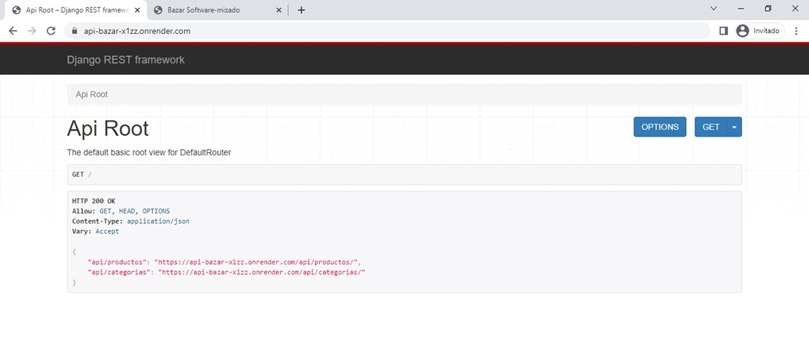
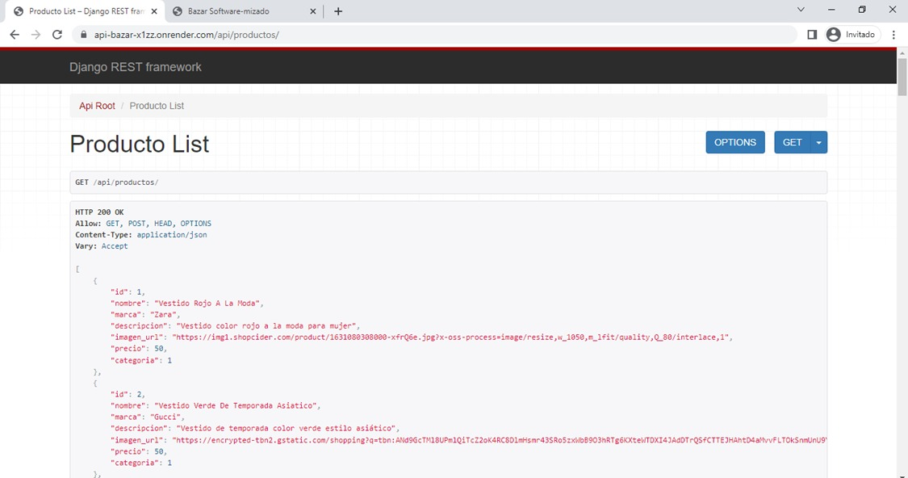
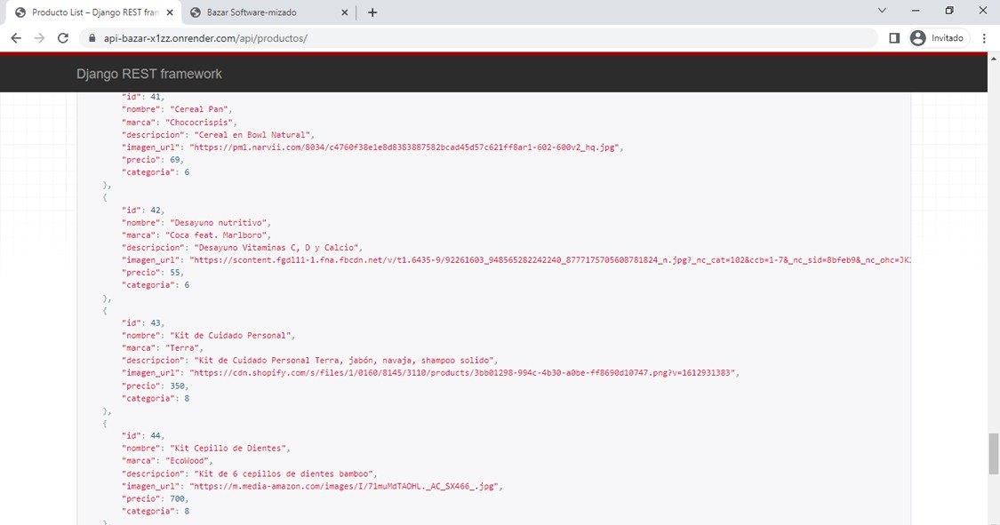

# bazar-api

Ana María Rojas Pérez,
Salma Vázquez Herrera,
Edgar Aguilar Garcia,
Yahir Alejandro Bañuelos Leo

# Frontend

El desarrollo frontend implicó la creación de la interfaz de usuario, que incluye el diseño visual, 
la disposición de los elementos en la pantalla, la interactividad y la experiencia del usuario. 
Se basa en tecnologías HTML (HyperText Markup Language), CSS (Cascading Style Sheets) y JavaScript.

# Backend

El desarrollo del backend implicó la creación de la lógica de programación, la implementación de algoritmos, 
la gestión de bases de datos y la manipulación de datos.

# Tecnologías

## Django

El framework utilizado fue Django:
Django es un framework de desarrollo web de alto nivel y de código abierto, escrito en Python. Proporciona una estructura sólida y predefinida para desarrollar aplicaciones web rápidamente y de manera eficiente.

Django se basa en el patrón de diseño Modelo-Vista-Controlador (MVC) y fomenta el principio de "baterías incluidas", 
lo que significa que viene con una amplia gama de características y funcionalidades integradas que aceleran el proceso de desarrollo. Estas características incluyen manejo de formularios, autenticación de usuarios, 
administración de bases de datos, generación de URLs, internacionalización y muchas más.

## Django Rest Framework

Django REST Framework es una biblioteca de Python que se utiliza para construir APIs web utilizando el framework Django. Proporciona herramientas y utilidades adicionales para facilitar la creación de APIs RESTful de forma rápida y sencilla.

Django REST Framework agrega capacidades de serialización y deserialización para convertir objetos Python en 
formatos de intercambio de datos como JSON o XML. También proporciona vistas genéricas y clases de serialización que permiten definir fácilmente
la lógica de la API y la forma en que los datos son representados y manipulados.

